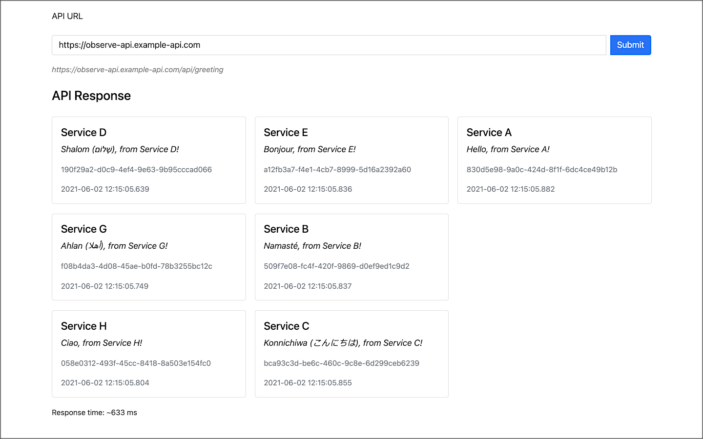
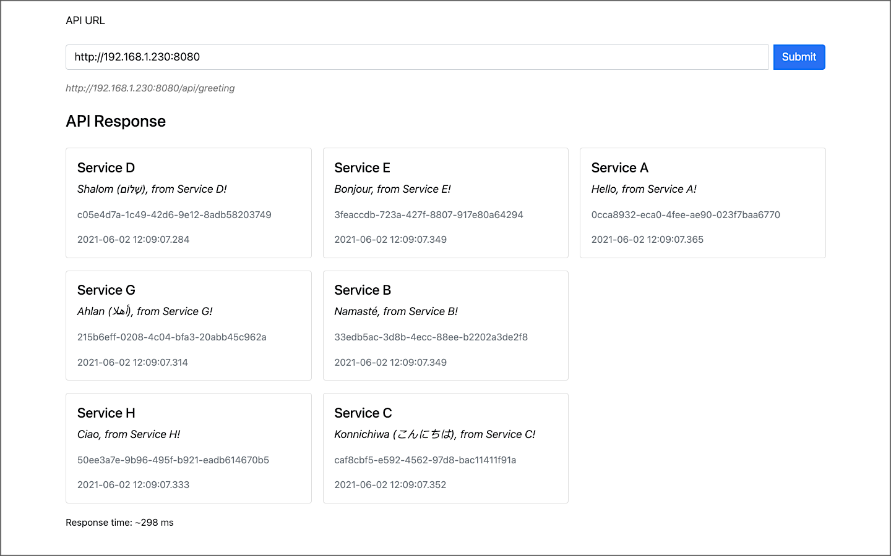

# Kubernetes-based Microservice Observability with Istio Service Mesh

Source code for the two-part blog
post, [Kubernetes-based Microservice Observability with Istio Service Mesh](https://garystafford.medium.com/kubernetes-based-microservice-observability-with-istio-service-mesh-part-1-of-2-19084d13a866). See the post for detailed instructions.


## Frontend UI

An Angular 12 front-end UI to the API is located on
Github: [k8s-istio-observe-frontend](https://github.com/garystafford/k8s-istio-observe-frontend/tree/2021-istio).



## Reference Platform Architecture


## Service Responses

On the reference platform, each upstream service responds to requests from downstream services by returning a small
informational JSON payload (termed a greeting in the source code).

```json
{
  "id": "01596496-c6f3-442e-8fa0-26c09783fac6",
  "service": "Service A",
  "message": "Howdy, from Service A!",
  "created": "2021-07-03 13:24:16.43337955 +0000 UTC",
  "hostname": "service-a-5648545d66-ddq28"
}
```

### Complete response from Service A

```json
{
  "greeting": [
    {
      "id": "01596496-c6f3-442e-8fa0-26c09783fac6",
      "service": "Service A",
      "message": "Howdy, from Service A!",
      "created": "2021-07-03 13:24:16.43337955 +0000 UTC",
      "hostname": "service-a-5648545d66-ddq28"
    },
    {
      "id": "90da9923-8b0b-4c3c-93cb-cc3a17568a5d",
      "service": "Service B",
      "message": "Namasté (नमस्ते), from Service B!",
      "created": "2021-07-03 13:24:16.454971435 +0000 UTC",
      "hostname": "service-b-6685bdf588-297hl"
    },
    {
      "id": "6a43f52e-97c3-4fda-b9db-1257759cf5e9",
      "service": "Service D",
      "message": "Shalom (שָׁלוֹם), from Service D!",
      "created": "2021-07-03 13:24:16.476144396 +0000 UTC",
      "hostname": "service-d-5f486b99b5-j7gkc"
    },
    {
      "id": "0ee4ec6d-1107-44b5-b53f-d243e628867c",
      "service": "Service E",
      "message": "Bonjour, from Service E!",
      "created": "2021-07-03 13:24:16.550752623 +0000 UTC",
      "hostname": "service-e-6769679f5f-q4l8s"
    },
    {
      "id": "51b978c3-9cfc-420f-9fb3-956853dc76ae",
      "service": "Service G",
      "message": "Ahlan (أهلا), from Service G!",
      "created": "2021-07-03 13:24:16.568093421 +0000 UTC",
      "hostname": "service-g-7cd66567c5-lwpft"
    },
    {
      "id": "179c99ef-d8a6-4e53-abd9-bbd13476bf86",
      "service": "Service H",
      "message": "Nǐ hǎo (你好), from Service H!",
      "created": "2021-07-03 13:24:16.618275186 +0000 UTC",
      "hostname": "service-h-8468c7888-jtxn9"
    },
    {
      "id": "cbb05fd4-68c4-4281-83a5-3fcd402b93fc",
      "service": "Service C",
      "message": "Konnichiwa (こんにちは), from Service C!",
      "created": "2021-07-03 13:24:16.665208081 +0000 UTC",
      "hostname": "service-c-7c8d674595-hx5z7"
    }
  ]
}
```

## Optional Docker Swarm Deployment

In addition to Kubernetes, you can deploy the reference platform to Docker Swarm. Create Docker overlay network, and deploy Docker Swarm, locally, consisting of (12) containers:

- (1) Angular 12 frontend UI
- (8) backend Go-based microservices
- (1) RabbitMQ server with (1) queue
- (1) MongoDB server with (4) databases
- (1) Mongo Express

```bash
docker network create -d overlay --attachable golang-demo

docker stack deploy -c docker_swarm/stack.yml golang-demo
```

### View the Running Stack

```text
> docker stack services golang-demo --format "table {{.Name}}\t{{.Image}}\t{{.Ports}}" | sort

NAME                        IMAGE                                PORTS
golang-demo_angular-ui      garystafford/angular-observe:1.6.5   *:80->80/tcp
golang-demo_mongodb         mongo:4.4.6                          *:27017->27017/tcp
golang-demo_mongo_express   mongo-express:0.54.0                 *:8081->8081/tcp
golang-demo_rabbitmq        rabbitmq:3.8.16-management-alpine    *:5672->5672/tcp, *:15672->15672/tcp
golang-demo_service-a       garystafford/go-srv-a:1.6.5          *:8080->8080/tcp
golang-demo_service-b       garystafford/go-srv-b:1.6.5
golang-demo_service-c       garystafford/go-srv-c:1.6.5
golang-demo_service-d       garystafford/go-srv-d:1.6.5
golang-demo_service-e       garystafford/go-srv-e:1.6.5
golang-demo_service-f       garystafford/go-srv-f:1.6.5
golang-demo_service-g       garystafford/go-srv-g:1.6.5
golang-demo_service-h       garystafford/go-srv-h:1.6.5
```

### Accessing the Docker Swarm-based Stack

To start, call the Angular 12 Frontend UI: <http://localhost>

The backend API's URL will be: <http://localhost:8080>

Alternately, call Service A, the system's edge service, directly: <http://localhost:8080/api/greeting>

To observe the queue traffic, use the RabbitMQ Management Console: <http://localhost:15672>

To observe the databases, use Mongo Express: <http://localhost:8081>

### View of UI running on Docker

